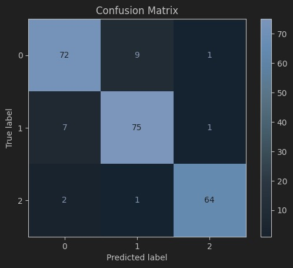

# Transformer-LSTM-GRU

## Model Improvements

### Data
Some of the data distributions are not balanced, so minor adjustments were made to the data manually.

### Data Preprocessing
A classification function was written to ensure the implementation of the three-class prediction model. The target was classified and encoded using one-hot encoding and `change_percent_class`. Additionally, a sliding window function was created to allow the model to use data from the past *n* days to predict the value on day *n+1*. Subsequently, the processed features were normalized to improve training efficiency.

The self-attention mechanism was shifted from processing the next steps of GRU outputs to handling the time series data. Since the model only needs to process the final output of the time steps, the original mechanism is no longer applicable.

The activation function in the original model was changed to the `softmax` function, suitable for classification models. The loss function was updated to `categorical_crossentropy`, which is commonly used for classification models. Finally, the number of output units in the Dense layer of the model was changed to 3 to match the requirements of the three-class classification task.
### Model Evaluation
Defined the confusion matrix, ROC curve, and accuracy to facilitate model evaluation.

## Results

### Final Results
We ultimately improved the accuracy to 90.95%.

##### Visualization
From the confusion matrix and ROC curve, it can be seen that the current model classifies class2 perfectly. However, there is still room for improvement in the classification of class1 and class0.

